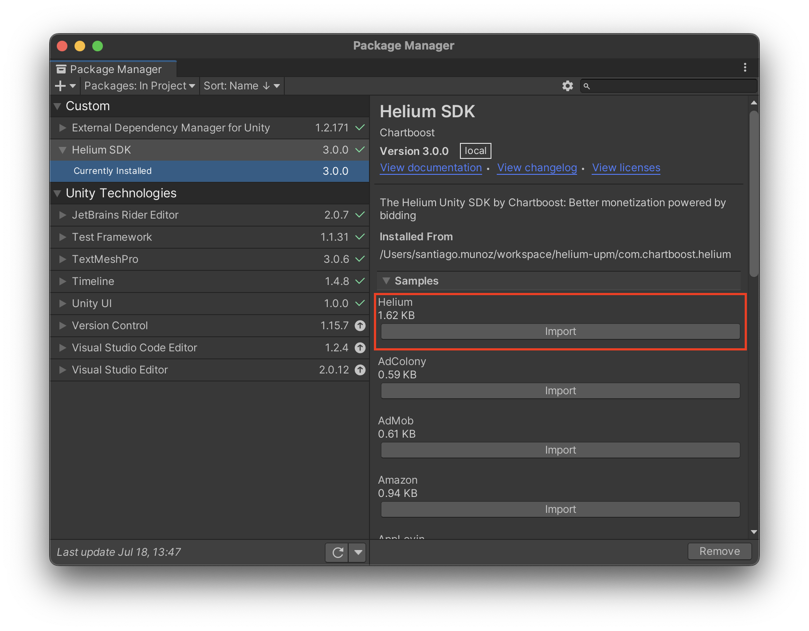

# Ad Adapters

## Dependency Resolution & Google External Dependency Manager (EDM)

The Helium Unity SDK does not embed Google’s EDM plugin.

If you want to integrate ad networks with other supported SDKs as well, you will need [Google's External Dependency Manager](https://developers.google.com/unity/archive#external_dependency_manager_for_unity). For more information see our recommended setup in [Google External Dependency Manager (EDM)](edm.md).

The Helium Unity SDK package contains samples with optional dependencies for ad adapters. Such samples can be found in the `Package Manager/Sample` sections.

Each Helium Unity SDK sample contains a .xml file with dependencies for the adapter available platforms (Android/iOS). In order for such dependencies to be included into the final build the [Google's External Dependency Manager](https://github.com/googlesamples/unity-jar-resolver) is needed.
The `EDM` makes sure to download and package any dependencies with your build.

## HeliumDependencies.xml

The HeliumDependencies.xml can be found in the `Package Manager/Sample` as seen in the following screenshot.

> **_NOTE:_** This is a mandatory dependency and must be imported for proper utilization of the Helium SDK.

## Ad Adapters as Optional Dependencies
In addition to the `HeliumDependencies.xml` file, the Helium Unity SDK includes optional dependencies based on the supported Ad Networks and its adapters.

They and can be found in the `Package Manager/Sample` area, and are labeled as follow:

`Optional-HeliumAdColonyDependencies.xml`

`Optional-HeliumAdMobDependencies.xml`

`Optional-HeliumAppLovinDependencies.xml`

`Optional-HeliumFacebookDependencies.xml`

`Optional-HeliumTapjoyDependencies.xml`

`Optional-HeliumVungleDependencies.xml`

`Optional-HeliumUnityAdsDependencies.xml`

`Optional-HeliumIronSourceDependencies.xml`

`Optional-HeliumFyberDependencies.xml`

`Optional-HeliumInMobiDependencies.xml`

`Optional-HeliumMintegralDependencies.xml`

`Optional-HeliumYahooDependencies.xml`

They can be obtained by importing them as Samples with Unity's Package Manager.

> **_NOTE:_** When including 3rd-Party SDKs on android, remember to update the manifest file according to the integrated SDK’s requirements as well.
