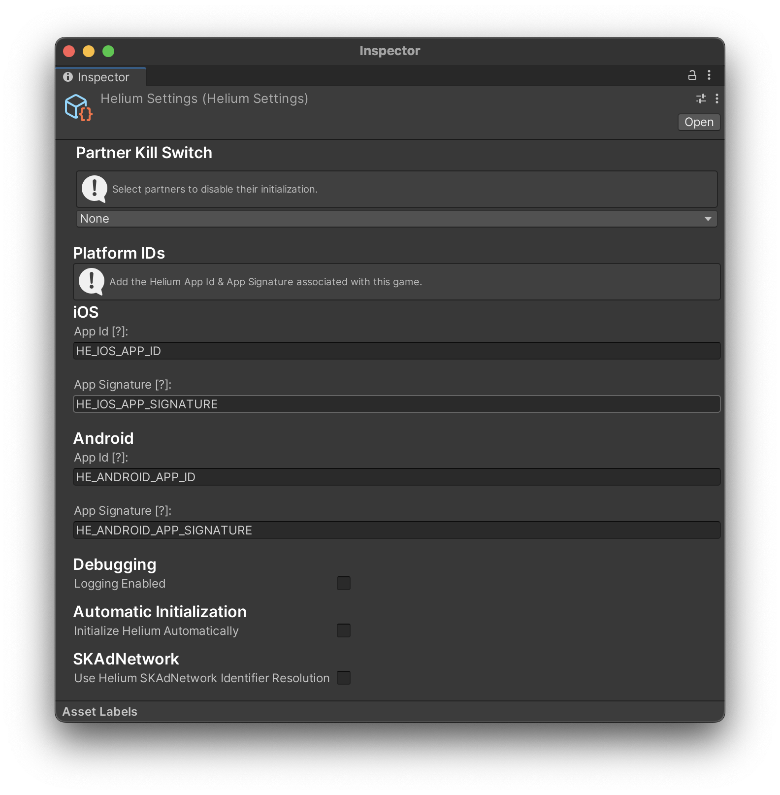

# Initialization

## Adding the import header

Add the following import header to the top of any class file that will be using a Helium class.

```c#
using Helium;
```

## Initializing Helium SDK

In order to initialize the Helium SDK, you will need your Helium App ID & App Signature. This can be obtained in your [Helium Dashboard](https://helium.chartboost.com
).

There are 2 ways you can go about providing your App IDs to the Helium SDK.

### Scriptable Object & Automatic Initialization

Go to **Helium** > **Edit Settings**

Add your **Helium App ID** and **Helium App Signature**

Enable Automatic Initialization on the Helium Settings Scriptable object.

#### Default Helium Settings



> **_NOTE:_** Make sure that these are the Helium AppId and App Signature values that you obtain directly from your Helium Dashboard for your app as opposed to credentials from Chartboost or any other Ad Network.

### Manual Initialization

If you would like to have more control on when to initialize the Helium SDK

You can call the following on your `Awake` method.

```c#
var appID = "SAMPLE_APP_ID";
var appSignature = "SAMPLE_APP_SIGNATURE";


#if UNITY_ANDROID
appID = HeliumSettings.GetAndroidAppId();
appSignature = HeliumSettings.GetAndroidAppSignature();
#elif UNITY_IOS
appID = HeliumSettings.GetIOSAppId();
appSignature = HeliumSettings.GetIOSAppSignature();
#endif

HeliumSDK.StartWithAppIdAndAppSignature(appID, appSignature);
```

This will start the Helium SDK. For delegate information see section [Delegate Usage](delegate-usage.md)

> **_NOTE:_** Failing to remove fillers such as HELIUM_APP_ID and HELIUM_APP_SIGNATURE will result in an error.

Once the Helium SDK has successfully started, you can start requesting ads.
