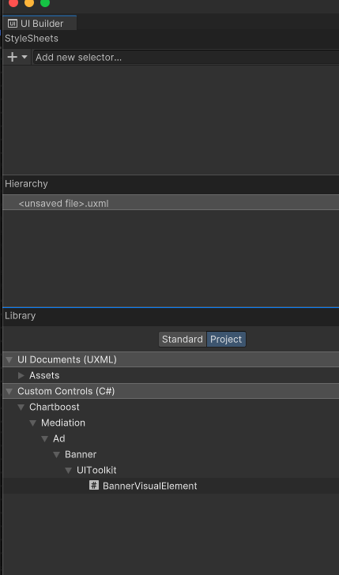

# Chartboost Mediation - Banner Visual Element

The Chartboost Mediation SDK includes BannerVisualElement, a specialized banner API that functions as a `VisualElement`, allowing it to be attached directly to a UIToolkit VisualTree (and/or UIDocument).
This integration enables developers to utilize BannerVisualElement similarly to other VisualElement within Unity UIToolkit, providing a seamless way to load and display banner ads directly within the game environment.

# `BannerAdLoadRequest`

`BannerAdLoadRequest` objects contains publisher provided configurations for `BannerVisualElement` objects. It is used when calling `BannerVisualElement.Load(loadRequest)`, as seen in the examples below.

```csharp
// Determine the maximum size to load using width and height
BannerSize size = BannerSize.Adaptive(100, 100);
BannerAdLoadRequest loadRequest = new BannerAdLoadRequest("BANNER_PLACEMENT_NAME", size);
```

# Keywords

Keywords are set after obtaining the `BannerVisualElement` object when calling `ChartboostMediation.GetBannerVisualElement`. To remove keywords, pass a new set without those keywords. The list will be overridden. This is to facilitate the wrapping process between Unity and native platforms.

> **Warning** \
> Keywords has restrictions for setting keys and values. The maximum characters allowed for keys is 64 characters. The maximum characters for values is 256 characters.

```csharp
// Keywords to pass for unity banner ad
var keywords = new Dictionary<string, string>
{
    { "key", "value" },
    { "key_2", "value_2" }
};

// Get BannerVisualElement
BannerVisualElement bannerVisualElement = ChartboostMediation.GetBannerVisualElement("PLACEMENT_NAME");

// Set keywords
bannerVisualElement.Keywords = keywords;
```

# Using `BannerVisualElement` objects

To create this visualElement using [UI Builder](https://docs.unity3d.com/6000.0/Documentation/Manual/UIBuilder.html), drag and drop the `BannerVisualElement` from the Project tab of the Library window into your Hierarchy window.



# Loading `BannerVisualElement` Objects
```csharp
// Get reference to `BannerVisualElement` from UIDocument
var bannerVisualElement = FindObjectOfType<UIDocument>().rootVisualElement.Q<BannerVisualElement>("YOUR_BANNER_NAME");

// Or create one at runtime
var bannerVisualElement = ChartboostMediation.GetBannerVisualElement("PLACEMENT_NAME");

// Place this at the top-right corner of screen
var panel = FindObjectOfType<UIDocument>().rootVisualElement.panel;
var bannerVisualElement = ChartboostMediation.GetBannerVisualElement("PLACEMENT_NAME");
panel.visualTree.Add(bannerVisualElement);

bannerVisualElement.style.position = Position.Absolute;
bannerVisualElement.style.top = 0;
bannerVisualElement.style.right = 0;

// Set callbacks
bannerVisualElement.WillAppear += ad => Debug.Log($"BannerVisualElement: {ad.LoadId} will appear.");
bannerVisualElement.DidClick += ad => Debug.Log($"BannerVisualElement: {ad.LoadId} was clicked.");
bannerVisualElement.DidClick += ad => Debug.Log($"BannerVisualElement: {ad.LoadId} was clicked.");
bannerVisualElement.DidBeginDrag += (ad,x,y) => Debug.Log($"BannerVisualElement: {ad.LoadId} began dragging x:{x}/y:{y}.");
bannerVisualElement.DidDrag += (ad,x,y) => Debug.Log($"BannerVisualElement: {ad.LoadId} was dragged x:{x}/y:{y}.");
bannerVisualElement.DidEndDrag += (ad,x,y) => Debug.Log($"BannerVisualElement: {ad.LoadId} finished dragging x:{x}/y:{y}.");
bannerVisualElement.DidRecordImpression += ad => Debug.Log($"BannerVisualElement: {ad.LoadId} was clicked.");

// Load with this visualElement's rect size as request size for banner
var loadResult = await bannerVisualElement.Load();

// Or use a custom load request

// Create load request
var loadRequest = new BannerAdLoadRequest(
    "PLACEMENT_NAME",
    BannerSize.Adaptive6X1(100)    // This can be any other size or the old non-adaptive size like `BannerSize.Standard`
);
var loadResult = await bannerVisualElement.Load(loadRequest);
if(!loadResult.Error.HasValue)
{
    // loaded successfullly
}

```

## Loading in async Context
```csharp
...
// Load the banner ad with our previously configured load request
BannerAdLoadResult loadResult = await bannerVisualElement.Load(loadRequest);
if(loadResult.Error.HasValue)
{
    // report load error
    return;
}
// loaded successfully
```

## Loading in sync Context
A lot of APIs provided in the Chartboost Mediation Unity SDK utilize the async/await C# implementation. It is possible for developers to try to call the following code from a sync context where async/await might not be supported:

```csharp
bannerVisualElement.Load(loadRequest).ContinueWithOnMainThread(continuation =>
{
    loadResult = continuation.Result;
});
```

# `BannerAdLoadResult`

`BannerAdLoadResult` contains information regarding the load for `BannerVisualElement` objects. Its result can be used as seen below:

```csharp
// Check if BannerVisualElement failed to load
var error = loadResult.Error;

// Failed to load
if (error.HasValue)
{
    // Report load failure
    Debug.LogError($"`BannerVisualElement` Load failed with error: {JsonTools.SerializeObject(error.Value, Formatting.Indented)}");
    return;
}

// Load succeeded

// Report metrics and show success
var loadId = loadResult.LoadId;
var metricsJson = JsonTools.SerializeObject(loadResult.Metrics, Formatting.Indented);
var winningBidInfo = JsonTools.SerializeObject(loadResult.WinningBidInfo, Formatting.Indented);
Debug.Log($"`BannerVisualElement` loaded successfully with:\n" +
          $"LoadId: {loadId}\n" +
          $"Metrics: {metricsJson}\n" +
          $"Winning Bid Info: {winningBidInfo}");

```

# Dispose

You can free up resources directly by calling `bannerVisualElement.Dispose()` method

```csharp
...
// Get reference to `BannerVisualElement` from scene
var bannerVisualElement = FindObjectOfType<UIDocument>().rootVisualElement.Q<BannerVisualElement>("YOUR_BANNER_NAME");

// Do what we need to do with our BannerVisualElement

// Free up resources
bannerVisualElement.Dispose();

// or you can just remove the `BannerVisualElement` from the scene. This would internally call dispose.
bannerVisualElement.parent.Remove(BannerVisualElement);
```

> **Note** \
> While this is not a necessary call, since `BannerVisualElement` objects will be disposed by the garbage collector once they are no longer referenced. It is still a good practice to disposed of unmanaged resources when no longer needed.
