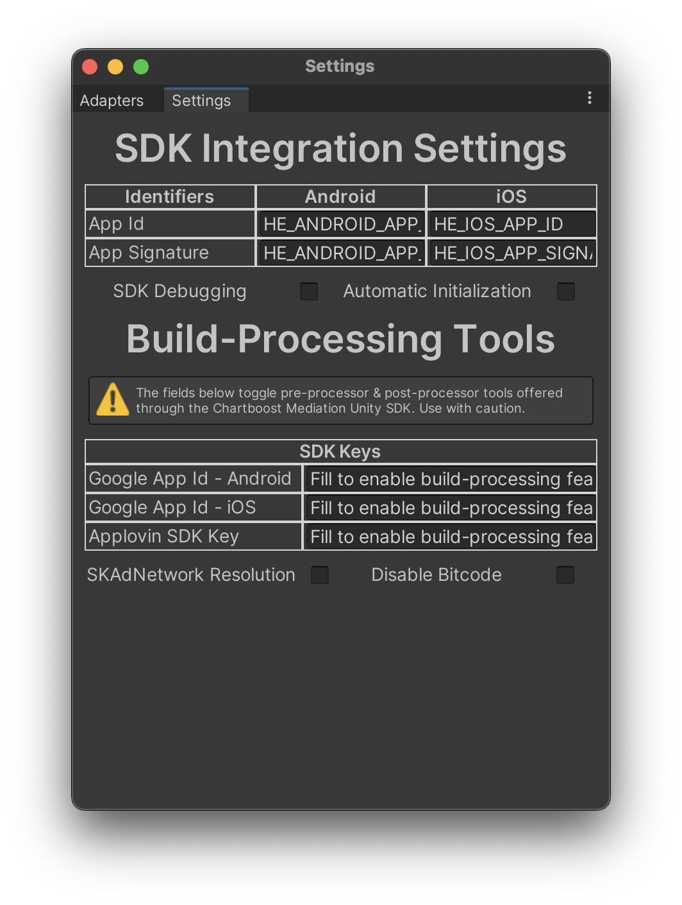

# Initialization

## Adding the import header

Add the following import header to the top of any class file that will be using a Chartboost Mediation class.

```c#
using Chartboost;
```

## Initializing Chartboost Mediation Unity SDK

In order to initialize the Chartboost Mediation Unity SDK, you will need your Chartboost Mediation App ID & App Signature. This can be obtained in your [Chartboost Mediation Dashboard](https://helium.chartboost.com).
There are 2 ways you can go about providing your App IDs to the SDK.

### Chartboost Mediation Settings & Automatic Initialization

Go to **Chartboost Mediation** > **Edit Settings**

Add your **Chartboost Mediation App ID** and **Chartboost Mediation App Signature**

Enable Automatic Initialization on the Chartboost Mediation Settings Scriptable object.

#### Chartboost Mediation Settings Static Accessors

ChartboostMediationSettings parameters can be modified via the available static accessors. As follows:

```c#
// IOS IDs Accessors
ChartboostMediation.IOSAppId = "SAMPLE_APP_ID_IOS";
ChartboostMediation.IOSAppSignature = "SAMPLE_APP_SIGNATURE_IOS";

// Android IDs Accessors
ChartboostMediation.AndroidAppId = "SAMPLE_APP_ID_ANDROID";
ChartboostMediation.AndroidAppSignature = "SAMPLE_APP_SIGNATURE_ANDROID";

// Logging Status Accessor
ChartboostMediation.IsLoggingEnabled = false;

// Automatic Initialization Accessor
ChartboostMediation.IsAutomaticInitializationEnabled = false;

// Partner Kill Switch Accessor
ChartboostMediation.PartnersKillSwitch = ChartboostMediationPartners.None;

// SKAdNetwork Resolution by Chartboost Mediation
ChartboostMediation.IsSkAdNetworkResolutionEnabled = false;
```

The Chartboost Mediation Unity SDK automatically uses such parameters to make decisions, the APIs are exposed for ease of usage.

### Default Chartboost Mediation Settings



> **Note** \
> Make sure that these are the AppId and App Signature values that you obtain directly from your Chartboost Mediation Dashboard for your app as opposed to credentials from Chartboost or any other Ad Network.

### Manual Initialization

If you would like to have more control on when to initialize the Chartboost Mediation SDK

You can call the following on your `Awake` method.

```c#
// New Manual Initialization after 4.1.0
ChartboostMediation.StartWithAppIdAndAppSignature(ChartboostMediationSettings.AppId, ChartboostMediationSettings.AppSignature);


// Old Style of Manual Initialization Not Using ChartboostMediationSettings Scritable Object
var appId = "";
var appSignature = "";

#if UNITY_ANDROID
appId = "ANDROID_SAMPLE_APP_ID";
appSignature = "ANDROID_SAMPLE_APP_SIGNATURE";
#elif UNITY_IOS
appId = "IOS_SAMPLE_APP_ID";
appSignature = "IOS_SAMPLE_APP_SIGNATURE";
#endif

ChartboostMediation.StartWithAppIdAndAppSignature(appID, appSignature);
```

This will start the Chartboost Mediation Unity SDK. For delegate information see section [Delegate Usage](delegate-usage.md)

> **Warning** \
> Failing to remove default values will result in an error.

Once the Chartboost Mediation SDK has successfully started, you can start requesting ads.

### Partner Kill Switch

From Chartboost Mediation 3.3.0 forward, the Chartboost Mediation Unity SDK initialization method has been expanded to take in optional initialization parameters. One of those parameters is a set of partner adapter identifiers to skip initialization for the session.

In Unity, Chartboost Mediation partners are identified through the `ChartboostMediationPartners` enum. `ChartboostMediationPartners` implements enum flags, which means flags can be raised before initialization as needed.

By default, the Partner Kill Switch can be easily modified through the `ChartboostMediationSettings` scriptable object. By doing so, you can only enable/disable partner before builds are compiled. However, if your game utilizes a remote config supported service such as Leanplum, Swrve, etc. you can utilize remote config variables to enable/disable partners in deployed builds.

The following example disables AdMob, Facebook, and TapJoy before ChartboostMediation initialization. As long as the `ChartboostMediationSettings.PartnersKillSwitch` parameter is modified before initialization, the partner networks will be skipped during the initialization process.


```c#
ChartboostMediationSettings.PartnersKillSwitch = ChartboostMediationPartners.AdMob | ChartboostMediationPartners.MetaAdudienceNetwork | ChartboostMediationPartners.TapJoy;

var appID = "SAMPLE_APP_ID";
var appSignature = "SAMPLE_APP_SIGNATURE";

ChartboostMediation.StartWithAppIdAndAppSignature(appID, appSignature);
```
For more information on how to corroborate partner initialization data visit [Delegate Usage](delegate-usage.md)
