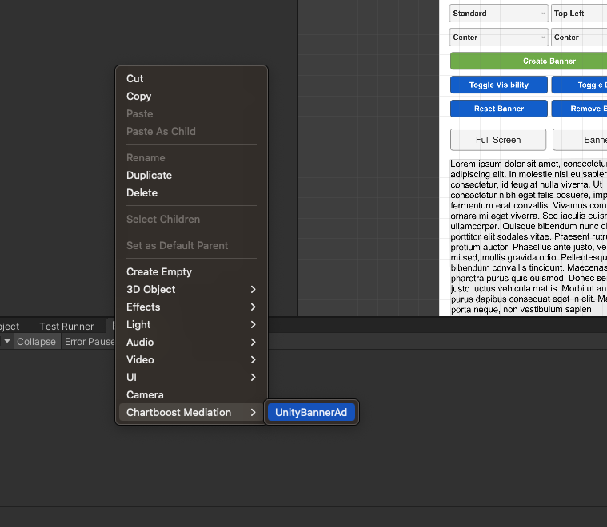

# Chartboost Mediation - Unity Banner Ad

The Chartboost Mediation SDK includes UnityBannerAd, a specialized banner API that functions as a `MonoBehaviour`, allowing it to be attached directly to a Unity GameObject.
This integration enables developers to utilize UnityBannerAd similarly to other GameObjects within Unity, providing a seamless way to load and display banner ads directly within the game environment.

For full details about the ad format always refer to [Chartboost Documentation](https://docs.chartboost.com/en/mediation/integrate/unity/load-ads/#banner-ad-objects).

# `BannerAdLoadRequest`

`BannerAdLoadRequest` objects contains publisher provided configurations for `UnityBannerAd` objects. It is used when calling `UnityBannerAd.Load(loadRequest)`, as seen in the examples below.

```csharp
// Determine the maximum size to load using width and height
BannerSize size = BannerSize.Adaptive(100, 100);
BannerAdLoadRequest loadRequest = new BannerAdLoadRequest("BANNER_PLACEMENT_NAME", size);
```

# Using `UnityBannerAd` objects

To create this gameobject, right-click in the hierarchy window and select Chartboost Mediation/UnityBannerAd.


# Loading `UnityBannerAd` Objects
```csharp
// Get reference to `UnityBannerAd` from scene
public UnityBannerAd unityBannerAd;

// Or create one at runtime
var unityBannerAd = ChartboostMediation.GetUnityBannerAd("PLACEMENT_NAME", FindObjectOfType<Canvas>().transform);

// Place this at the top-right corner of screen
unityBannerAd.transform.position = new Vector2(Screen.width, Screen.height);
unityBannerAd.GetComponent<RectTransform>().pivot = new Vector2(1, 1);

// Set callbacks
unityBannerAd.WillAppear += ad => Debug.Log($"UnityBannerAd: {ad.LoadId} will appear.");
unityBannerAd.DidClick += ad => Debug.Log($"UnityBannerAd: {ad.LoadId} was clicked.");
unityBannerAd.DidDrag += (ad,x,y) => Debug.Log($"UnityBannerAd: {ad.LoadId} was dragged x:{x}/y:{y}.");
unityBannerAd.DidRecordImpression += ad => Debug.Log($"UnityBannerAd: {ad.LoadId} was clicked.");

// Load with this gameobject's rect size as request size for banner
var loadResult = await unityBannerAd.Load();

// Or use a custom load request

// Create load request
var loadRequest = new BannerAdLoadRequest(
    "PLACEMENT_NAME",
    BannerSize.Adaptive6X1(100)    // This can be any other size or the old non-adaptive size like `BannerSize.Standard`
);
var loadResult = await unityBannerAd.Load(loadRequest);
if(!loadResult.Error.HasValue)
{
    // loaded successfullly
}

```

## Loading in async Context
```csharp
...
// Load the banner ad with our previously configured load request
BannerAdLoadResult loadResult = await unityBannerAd.Load(loadRequest);
if(loadResult.Error.HasValue)
{
    // report load error
    return;
}
// loaded successfully
```

## Loading in sync Context
A lot of APIs provided in the Chartboost Mediation Unity SDK utilize the async/await C# implementation. It is possible for developers to try to call the following code from a sync context where async/await might not be supported:

```csharp
// Show `UnityBannerAd` using async approach
unityBannerAd.Load(loadRequest).ContinueWithOnMainThread(continuation =>
{
    loadResult = continuation.Result;
});
```

# `BannerAdLoadResult`

`BannerAdLoadResult` contains information regarding the load for `UnityBannerAd` objects. Its result can be used as seen below:

```csharp
// Check if UnityBannerAd failed to load
var error = adShowResult.Error;

// Failed to load
if (error.HasValue)
{
    // Report load failure
    Debug.LogError($"`UnityBannerAd` Load failed with error: {JsonTools.SerializeObject(error.Value, Formatting.Indented)}");
    return;
}

// Load succeeded

// Report metrics and show success
var loadId = loadResult.LoadId;
var metricsJson = JsonTools.SerializeObject(loadResult.Metrics, Formatting.Indented);
var winningBidInfo = JsonTools.SerializeObject(loadResult.WinningBidInfo, Formatting.Indented);
Debug.Log($"`UnityBannerAd` loaded successfully with:\n" +
          $"LoadId: {loadId}\n" +
          $"Metrics: {metricsJson}\n" +
          $"Winning Bid Info: {winningBidInfo}");

```

# Dispose

You can free up resources directly by calling the unity method [Destroy](https://docs.unity3d.com/ScriptReference/Object.Destroy.html)

```csharp
...
// Get reference to `UnityBannerAd` from scene
public UnityBannerAd unityBannerAd;

// Do what we need to do with our UnityBannerAd

// Free up resources
Destroy(unityBannerAd);
```

> **Note** \
> While this is not a necessary call, since `UnityBannerAd` objects will be disposed by the garbage collector once they are no longer referenced. It is still a good practice to disposed of unmanaged resources when no longer needed.
