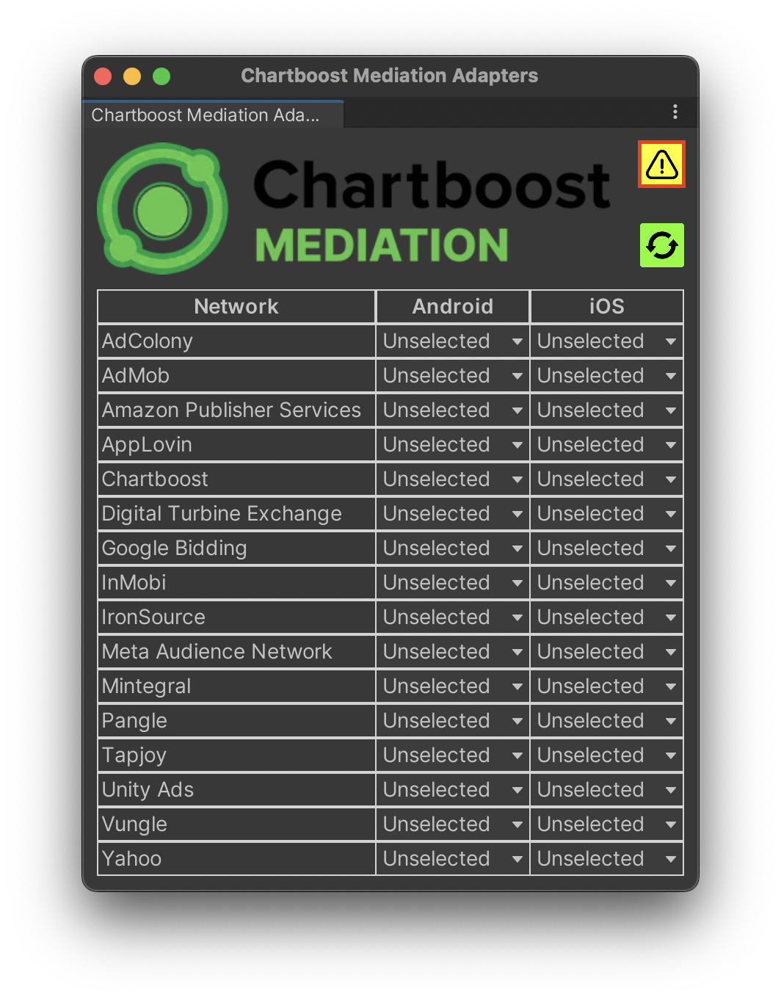
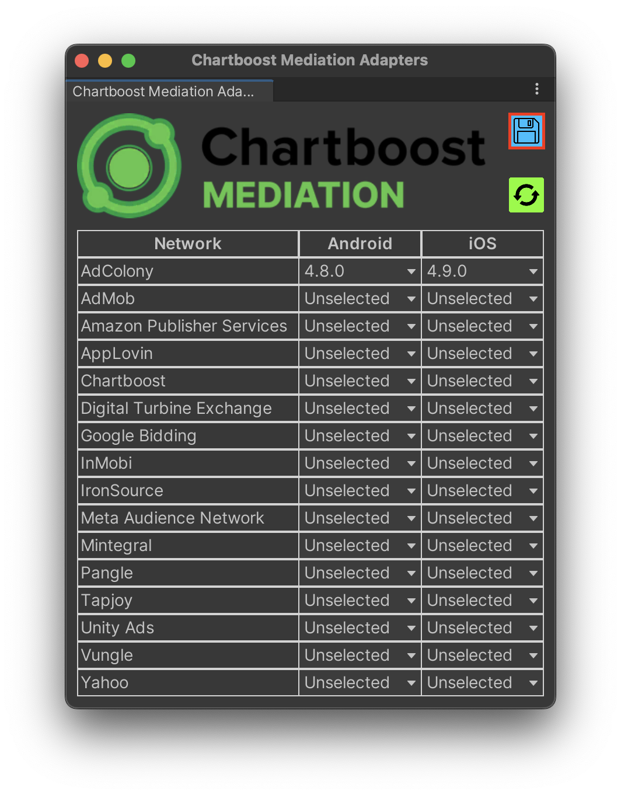
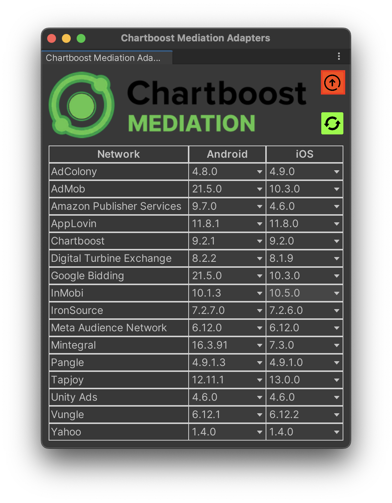
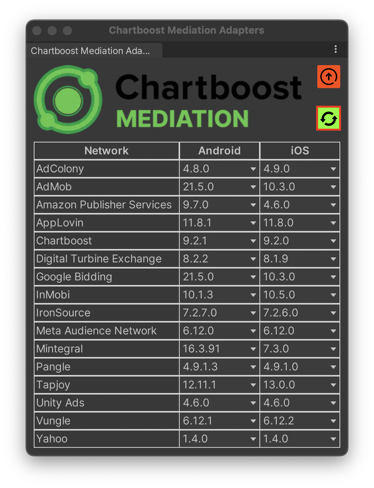

# Ad Network Adapters

## Dependency Resolution & Google External Dependency Manager (EDM)

The Chartboost Mediation Unity SDK does not embed Google’s EDM plugin.

If you want to integrate ad networks with other supported SDKs as well, you will need [Google's External Dependency Manager](https://developers.google.com/unity/archive#external_dependency_manager_for_unity). For more information see our recommended setup in [Google External Dependency Manager (EDM)](edm.md).

The Chartboost Mediation Unity SDK package contains samples with optional dependencies for ad adapters. Such samples can be found in the `Package Manager/Sample` sections.

Each Chartboost Mediation Unity SDK sample contains a .xml file with dependencies for the adapter available platforms (Android/iOS). In order for such dependencies to be included into the final build the [Google's External Dependency Manager](https://github.com/googlesamples/unity-jar-resolver) is needed.
The `EDM` makes sure to download and package any dependencies with your build.

## Chartboost Mediation Adapters Window

Since Chartboost Mediation 4.X Adapters are no longer released at the cadence as the Chartboost Mediation SDK, it is now possible to receive adapter updates in between SDK releases. 

As of Chartboost Mediation Unity SDK 4.1.0, adapters were added through the UPM Samples capability; however, this limited the ability to provide adapter updates in between SDK releases. As such, from Chartboost Mediation Unity SDK 4.2.0, we have created a brand new Editor Window. This will allow users to fetch Ad Adapter updates on demand. *see screenshot below*

### ***Adapters Window Default State***

The Adapters window can be accessed through the following unity menu: ***Chartboost Mediation/Adapters***


As seen, in the screenshot above, in its default state, the Adapters Window does not select any adapters, and there are multiple elements grabbing your attention. For a detailed step-by-step intruction on how to use the window see below:

### ChartboostMediationDependencies.xml

Although Chartboost Mediation Unity SDK can be initialized without adapters. You still need to have a reference to the Chartboost Mediation Native libraries. Whenever such dependencies are missing or miss-matching with your currently implemented version, the following warning button will show up. ***see below***



If you wish to know more details, you can always hover over the warning to see more details. In order to resolve the warnings, you just need to press the warning button itself. In most scenarios, this will add or update your `ChartboostMediationDependencies.xml` dependency file. 

After resolving the warnings, the `ChartboostMediationDependencies.xml` dependency file can be found in the following path 
`Assets/com.chartboost.mediation/Editor/ChartboostMediationDependencies.xml`

> **_NOTE:_** In the past, dependencies used to live under the `Assets/Samples/Chartboost Mediation/ 4.X` path. However, they will now be under the `Assets/com.chartboost.mediation/Editor` directory.

### Adding Ad Adapters

In order to add adapters, you only need to select a version from the platform specific dropdowns. ***see below*** 



As seen in the screenshot above, whenever changes are pending to be saved, the save button will be displayed. In order to save your adapter selections you must click on the save button. After saving, the corresponding dependencies for the Ad Adapter selections will be saved in the following path `Assets/com.chartboost.mediation/Editor/Adapters`.

> **_NOTE:_** If you wish to see all of your Ad Adapter selections in your project, they can be found in the following file `Assets/com.chartboost.mediation/Editor/selections.json`. If you ever need to provide support with information regarding your Ad Adapter selections, you can use this file.

> **_NOTE:_** Ad Networks can be implemented entirely (Android, IOS) or partially, only one platform. 

### Window Utilities

#### **Upgrade All Selections**

Once you have all of your selections, you can always manually check for updates by pressing the upgrades button. Found in the top right corner. Using the upgrade button will compare your current selections with the most up to date adapter releases. If any changes are found, you will be notified and asked to save such changes.



#### **Refresh**

Adapter information is fetched automatically on Unity Editor's startup. If you wish you check for updates on demand, you can use the refresh button. ***see below*** 



Using the refresh button will check for new adapter releases, update your cached adapter info, and repaint the Adapters Window if necessary.

## C# Utility API

Along with the Editor Window, we have exposed a few C# methods that can be utilized in a CI/CD environment to keep your adapters up to date.

Below is a demonstration on how to use such API:

```csharp

// AdapterDataSource is in charge of fetching adapter updates, runs once on Editor startup, but you will need to call it manually if running in batchmode
AdapterDataSource.Update();

// Loads current project adapter selections
AdaptersWindow.LoadSelections();

// Perform Ad Adapter upgrades, platform flags available for customization
var upgrades = AdaptersWindow.UpgradePlatformToLatest(Platform.Android | Platform.IOS);

// Depending on upgrade results, information can be logged.
Console.WriteLine(upgrades.Count > 0 ? $"[Adapters] Upgraded: \n {JsonConvert.SerializeObject(upgrades, Formatting.Indented)}" : "[Adapters] No Upgrades.");

// Ad newly found Ad Adapter networks, by default any partially implemented or newly found networks will be added, but such behavior can be customized.
var newNetworks = AdaptersWindow.AddNewNetworks(Platform.Android | Platform.IOS);

// Manually save selections
AdaptersWindow.SaveSelections();

// Depending on new networks result, information can be logged.
Console.WriteLine(newNetworks.Count > 0 ? $"[Adapters] New Networks: \n {JsonConvert.SerializeObject(newNetworks, Formatting.Indented)}" :  "[Adapters] No New Networks");

// This will resolve any issues with your Chartboost Mediation dependency, e.g if your package does not match your current dependency file, this method makes sure to update the file as needed.
var changed = AdaptersWindow.CheckChartboostMediationVersion();
Console.WriteLine(changed ? "[Adapters] Chartboost Mediation Version Has Been Updated" :  "[Adapters] Chartboost Mediation Version is Up to Date");
```

### Adding Networks through the C# API

As mentioned in the previous section, networks can be added based on specific conditions.

#### Default Network Addition Condition

```csharp
/// <summary>
/// Default network add condition. This will add any entirely missing or partially implemented networks
/// </summary>
/// <param name="id">network id</param>
/// <param name="currentSelections">current selections</param>
/// <returns></returns>
private static bool DefaultAddCondition(string id, Dictionary<string, AdapterSelection> currentSelections) => !selections.ContainsKey(id) || selections[id].android == Constants.Unselected || selections[id].ios == Constants.Unselected;
```
Such condition is checked automatically when running `AdaptersWindow.AddNewNetworks`. However, it can be customized to fit your own needs. ***see below*** 

```csharp

// The method below will only add brand new networks and implemented them as needed.
private bool CustomCondition(string id, Dictionary<string, AdapterSelection> currentSelections) => !selections.ContainsKey(id);

// Addding networks only if they are entirely new
AdaptersWindow.AddNewNetworks(Platform.Android | Platform.IOS, CustomCondition);

// Another example, adding only brand new networks for Android
AdaptersWindow.AddNewNetworks(Platform.Android, CustomCondition);
```