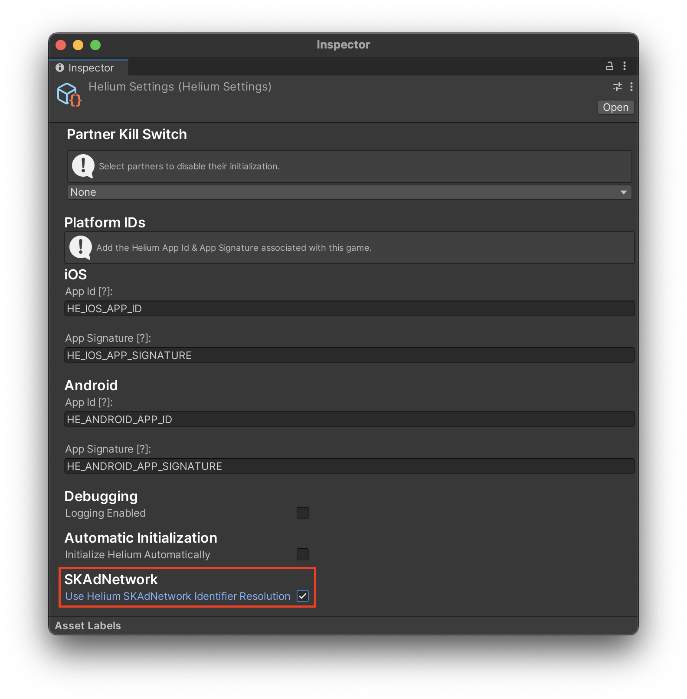

# Enabling SKAdNetwork In Your App

To add SKAdNetworks in your app, you need to add the SKAdNetworkIdentifier and their values in your app's Info.plist file. This process can be handled by totally controlled by you; however, after Chartboost Mediation 4.0.0, we have added a postprocessor to handle this process automatically if needed. 

If you wish to enable Chartboost Mediation's automatic SKAdNetwork resolution, all you need to do is click on **`Chartboost Mediation/Edit Settings`** and toggle the SKAdNetwork resolution. As seen below: 

> **Warning** \
> SKAdNetwork resolution is disabled by default.